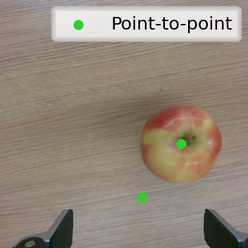
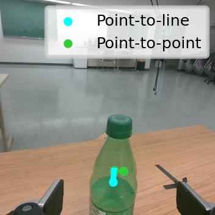
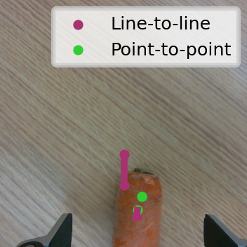
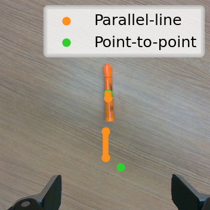

# vlm_robot_data
Dataset used in Kinova Gen3 experiments with Uncalibrated Visual Servoing

<p float="center">
  
  
  
  
</p>


## Download
[Google Drive Link](https://drive.google.com/file/d/1BhBlsihYJhet_V5skhd5AAsdJZPFkkGj/view?usp=drive_link)

## Visualization
A minimal visualization code is provided. To quickly run:

```
python3 visualize.py [directory path to a video]
```
